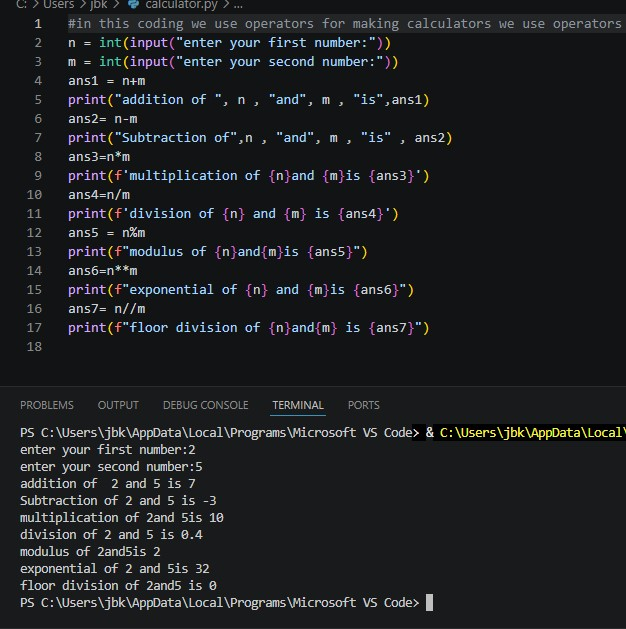

# Python Calculator

A basic calculator built using Python that performs arithmetic operations like:
- Addition
- Subtraction
- Multiplication
- Division
- Modulus
- Floor Division
- Exponentiation

## Technologies Used
- Python

## How to Run
1. Download or clone this repository
2. Run the file:
3. 

python calculator.py
## Project File

The main Python code is available in:
- calculator.py

## About Project
This project was created to practice Python fundamentals, functions, and user input handling.
